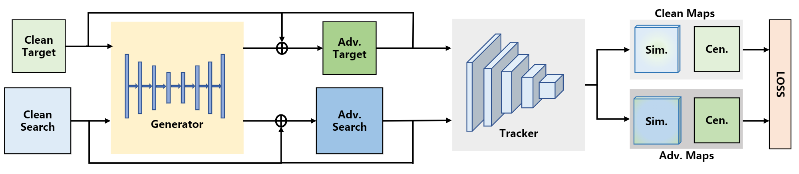
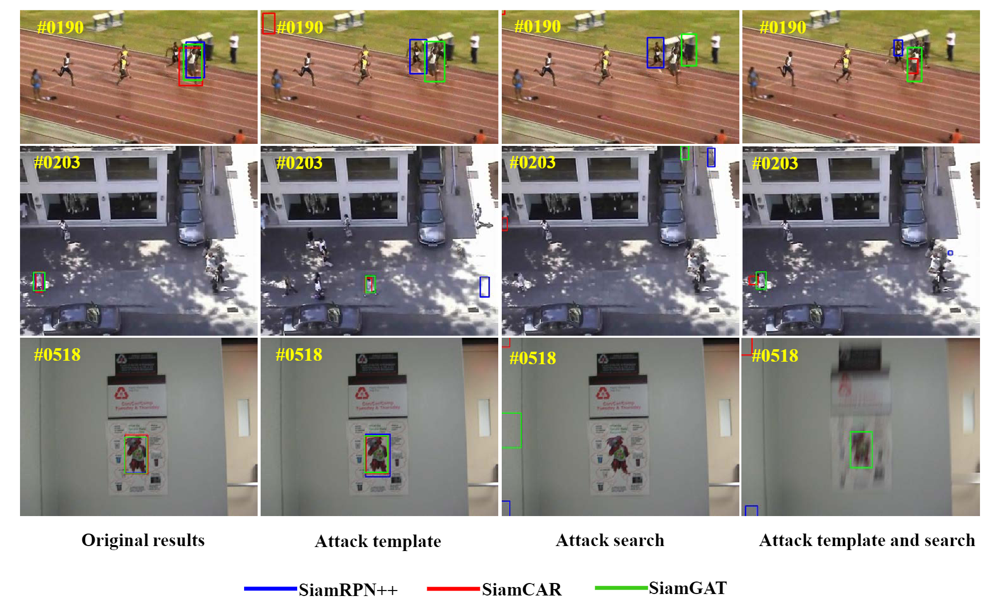
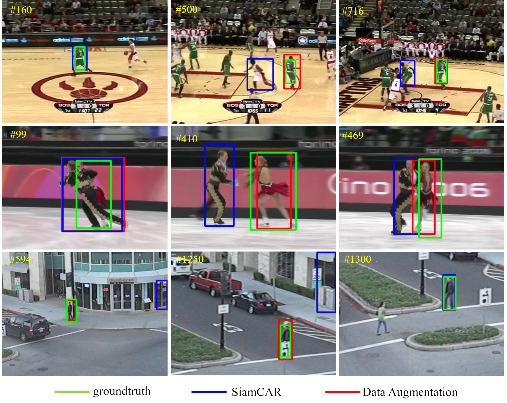

## Efficient method to fool and improve object tracking with adversarial perturbations.
The code will be all open source in the future and is currently being sorted out. . .
## Abstract

<p align="center"> </p>
<p align="center">  Attack </p>
<p align="center">  Data Aug </p>

## Attacking performance
Precision and Success on UAV123 dataset.

| Trackers                     |Original | Att.Template |  Att.Search | Att.T & S| Original | Att.Template |  Att.Search | Att.T & S|
|------------------------------|---------|--------------|-------------|----------|----------|--------------|-------------|----------|
| SiamRPN++                    | 0.804   | 0.642        |   0.435     | 0.550    | 0.611    | 0.461        | 0.296       | 0.378    |
| SiamCAR                      | 0.813   | 0.617        |   0.251     | 0.342    | 0.623    | 0.433        | 0.157       | 0.188    | 
| SiamBAN                      | 0.794   | 0.577        |   0.377     | 0.353    | 0.607    | 0.400        | 0.252       | 0.213    |
| SiamGAT                      | 0.843   | 0.830        |   0.732     | 0.760    | 0.646    | 0.638        | 0.531       | 0.564    |
| TrDiMP                       | 0.876   | 0.857        |   0.805     | 0.833    | 0.670    | 0.652        | 0.597       | 0.625    |

Precision and Success on OTB2015 dataset.

| Trackers |Original|Att.Template|Att.Search|Att.T & S| Original | Att.Template |  Att.Search | Att.T & S| 
|----------|--------|------------|----------|---------|----------|--------------|-------------|----------|
| SiamRPN++| 0.905  | 0.654      |   0.441  | 0.445   | 0.695    | 0.468        | 0.323       | 0.274    |
| SiamCAR  | 0.910  | 0.656      |   0.322  | 0.373   | 0.697    | 0.479        | 0.223       | 0.225    |
| SiamBAN  | 0.910  | 0.629      |   0.414  | 0.297   | 0.696    | 0.431        | 0.311       | 0.177    |
| SiamGAT  | 0.916  | 0.884      |   0.848  | 0.874   | 0.710    | 0.686        | 0.651       | 0.675    |
| TrDiMP   | 0.925  | 0.897      |   0.835  | 0.881   | 0.708    | 0.685        | 0.632       | 0.673    | 

EAO, Accuracy and Robustness on VOT2018 dataset.

| Trackers |Original | Att.Template |  Att.Search | Att.T & S| Original | Att.Template |  Att.Search | Att.T & S| Original | Att.Template |  Att.Search | Att.T & S|
|----------|---------|--------------|-------------|----------|----------|--------------|-------------|----------|----------|--------------|-------------|----------|
| SiamRPN++| 0.415   | 0.104        |   0.068     | 0.093    | 0.601    | 0.490        | 0.485       | 0.429    | 0.234    | 1.208        | 2.117       | 1.461    |
| SiamCAR  | 0.408   | 0.129        |   0.059     | 0.086    | 0.585    | 0.500        | 0.394       | 0.333    | 0.229    | 1.077        | 2.575       | 1.541    | 
| SiamBAN  | 0.447   | 0.091        |   0.053     | 0.047    | 0.590    | 0.459        | 0.428       | 0.323    | 0.178    | 1.241        | 2.500       | 2.650    |
| TrDiMP   | 0.462   | 0.331        |   0.270     | 0.352    | 0.600    | 0.554        | 0.592       | 0.595    | 0.141    | 0.229        | 0.384       | 0.281    |

Normalized Precision, Precision and Success on LaSOT dataset.

| Trackers |Original | Att.Template |  Att.Search | Att.T & S| Original | Att.Template |  Att.Search | Att.T & S| Original | Att.Template |  Att.Search | Att.T & S|
|----------|---------|--------------|-------------|----------|----------|--------------|-------------|----------|----------|--------------|-------------|----------|
| SiamRPN++| 0.572   | 0.387        |   0.205     | 0.243    | 0.490    | 0.299        | 0.154       | 0.192    | 0.497    | 0.346        | 0.176       | 0.204    |
| SiamCAR  | 0.610   | 0.224        |   0.084     | 0.075    | 0.524    | 0.208        | 0.078       | 0.064    | 0.516    | 0.183        | 0.074       | 0.063    | 
| SiamBAN  | 0.594   | 0.384        |   0.197     | 0.129    | 0.518    | 0.342        | 0.145       | 0.102    | 0.514    | 0.340        | 0.161       | 0.105    |
| SiamGAT  | 0.633   | 0.611        |   0.552     | 0.559    | 0.530    | 0.507        | 0.453       | 0.462    | 0.539    | 0.524        | 0.465       | 0.471    |
| TrDiMP   | 0.730   | 0.717        |   0.587     | 0.637    | 0.662    | 0.646        | 0.515       | 0.556    | 0.639    | 0.630        | 0.512       | 0.553    |

## Installation
#### Clone the repository
```
git clone https://github.com/Rongmiq/CCA.git
cd <Project_name>
```
#### Create Environment
```
conda create -n CCA python=3.7
source activate CCA
conda install pytorch=1.0.0 torchvision cuda100 -c pytorch
pip install -r requirements.txt
conda install pillow=6.1
```

#### Prepare the training set (optional), from CSA.
1. Download the training set of GOT-10K.   
2. Then change 'got10k_path' and 'save_path' in Unified_GOT10K_process.py to yours.    
3. Finally, run the following script.   
(it takes a long time. After running it, you can do the next steps :)   
```
python Unified_GOT10K_process.py
```
#### Download pretrained models
1. SiamRPN++([Model_Zoo](https://github.com/STVIR/pysot/blob/master/MODEL_ZOO.md))   
Download **siamrpn_r50_l234_dwxcorr** and **siamrpn_r50_l234_dwxcorr_otb**  and rename them to **model.pth**.  
Put them under pysot/experiments/<MODEL_NAME>  
We use **siamrpn_r50_l234_dwxcorr_otb** test OTB2015 and **siamrpn_r50_l234_dwxcorr** test VOT2018, UAV123, and LaSOT.  

2. SiamCAR([Model_Zoo](https://github.com/ohhhyeahhh/SiamCAR))     
Download **general_modelr** and **LaSOT_model** and rename them to **model.pth** and **LaSOT_model.pth**, respectively.  
Put them under pysot/experiments/siamcar_r50.   
We use **LaSOT_model.pth** test LaSOT and **model.pth** test OTB2015, VOT2018, and UAV123.  

3. SiamBAN([Model_Zoo](https://github.com/hqucv/siamban/blob/master/MODEL_ZOO.md))  
Download **siamban_r50_l234** and **siamban_r50_l234_otb** and rename them to **model.pth** and **model_vot.pth**, respectively.   
Put them under pysot/experiments/siamban_r50.   
We use **model.pth** test OTB2015 and **model_vot.pth** test VOT2018, UAV123, and LaSOT.  

4. SiamGAT([Model Zoo](https://github.com/ohhhyeahhh/SiamGAT))  
Download models trained for OTB2015 and LaSOT and rename them to **model.pth**.  
Put them under pysot/experiments/Siamgat_googlenet and pysot/experiments/Siamgat_googlenet_lasot, respectively.  


6. Perturbation Generators  
Download checkpoints you need, then put them under checkpoints/<MODEL_NAME>/   
([Google Drive](https://drive.google.com/open?id=117GuYBQpj8Sq4yUNj7MRdyNciTCkpzXL),  
[Baidu](https://pan.baidu.com/s/1rlpzCWczWf6Hw5YnnQThOw)[Extraction code: 98rb])  


#### Set some paths
**Step1**: Add pix2pix and pysot to environment variables   
```
sudo gedit ~/.bashrc
# add the following two lines to the end
export PYTHONPATH=<CSA_PATH>:$PYTHONPATH
export PYTHONPATH=<CSA_PATH>/pysot:$PYTHONPATH
export PYTHONPATH=<CSA_PATH>/pix2pix:$PYTHONPATH
# close the file
source ~/.bashrc
```
**step2**: Set another paths
1. Gather testing datasets     
create a folder outside the project folder as <DATASET_ROOT>  
then put soft links for OTB100, VOT2018 and LaSOT into it   
2. Set 'project_path_' and 'dataset_root_'
Open common_path.py, go to the end     
project_path_ = <CSA_PATH>  
dataset_root_ = <DATASET_ROOT>
train_set_path_ = <TRAIN_SET_PATH>
## Training (Optional)
**Train a generator you need.**
**Option1: Attacking template branch**  

```
python train.py
```

Train a generator for attacking search regions (**Only Cooling**)  
```
python train0.py # See visualization in http://localhost:8096/
```
**Option2: Change Settings**  
&nbsp;&nbsp;&nbsp;&nbsp;&nbsp;&nbsp; If you want to train other models (like the generator for attacking the template), 
you can change the **lines 23 and 24** in pix2pix/options/**base_option0.py** (or base_option1.py). 
In specific, modify the default values to **'G_template_L2_500'** (or 'G_template_L2_500_regress'). 
Then run ```python train0.py``` or ```python train1.py```  
**Option3: Train Your Own Models**  
**Step1**: Create a new python file under pix2pix/models.   
&nbsp;&nbsp;&nbsp;&nbsp;&nbsp;&nbsp; You can copy a file that belongs to this folder, then develop based on it. 
Note that the class name must match the filename.   
**Step2**: Change default values and train (Do as instructions in Option2)
## Testing
open ```common_path.py```, choose the dataset and siamese model to use.  
open ```GAN_utils_xx.py```, choose the generator model to use.  
```cd pysot/tools```  
run experiments about attcking **search regions**  
```
python run_search_adv0.py # or run_search_adv1.py
```
run experiments about attacking **the template**  
```
python run_template_adv0.py # or run_template_adv1.py
```
run experiments about attacking **both search regions and the template**
```
python run_template_search_adv0.py # or run_template_search_adv1.py
```

This code are main based on ([CSA](https://github.com/MasterBin-IIAU/CSA/)), ([Pysot](https://github.com/STVIR/pysot)), and ([Pytracking](https://github.com/visionml/pytracking)).
